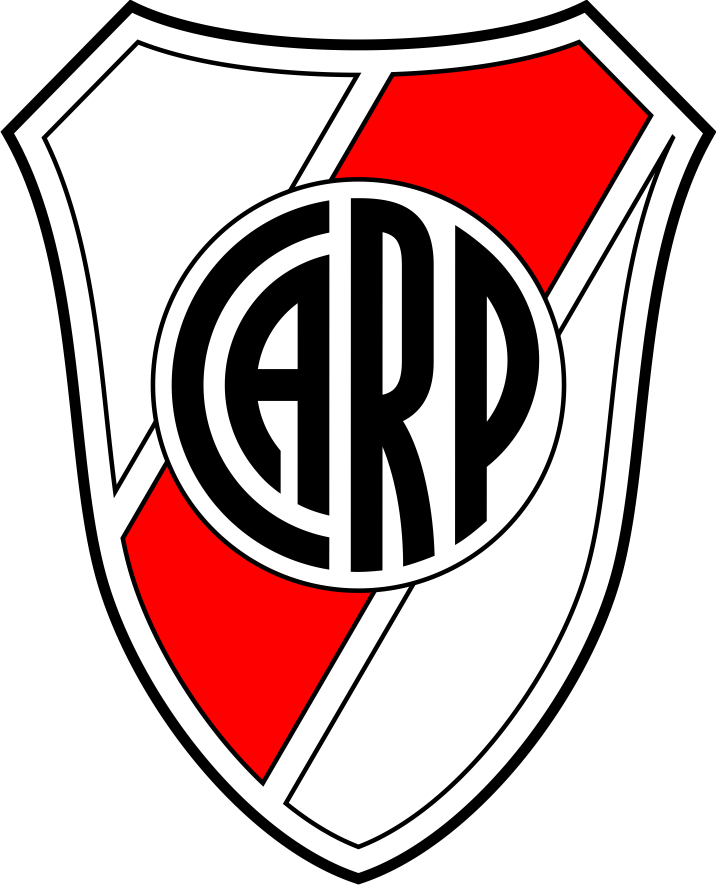
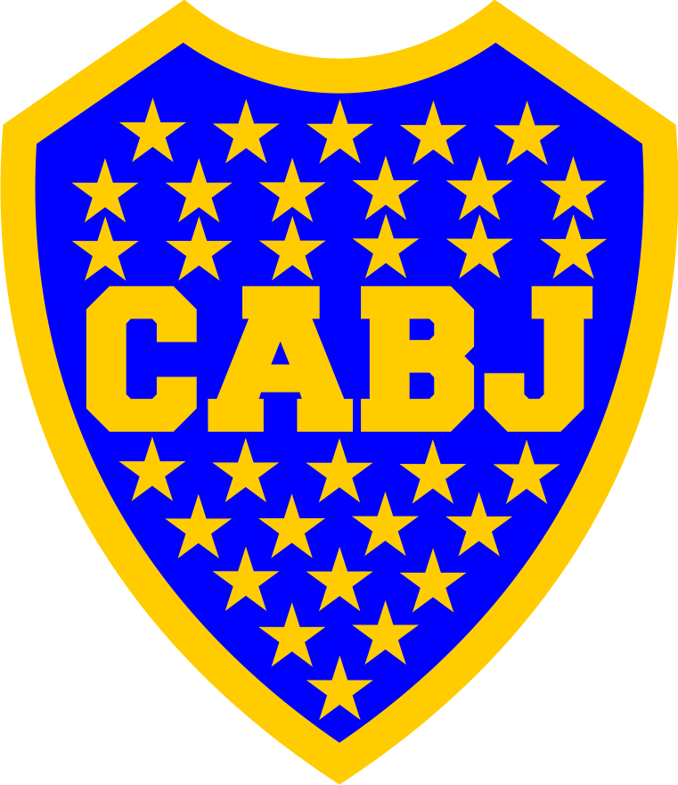

A football badge mashupper inspired in the twitter bot flagsmashup.

# Requirements

PIL

# Usage

python mashup.py -> combine the colors of two random badges.

python mashup.py team1 team2 -> combine of the two selected teams (put the colors of the team2 in the badge of team1).

For now the program only displays the created badge.

# Example

python mashup.py boca river

<dl>
	+
	 = 
	
</dl>